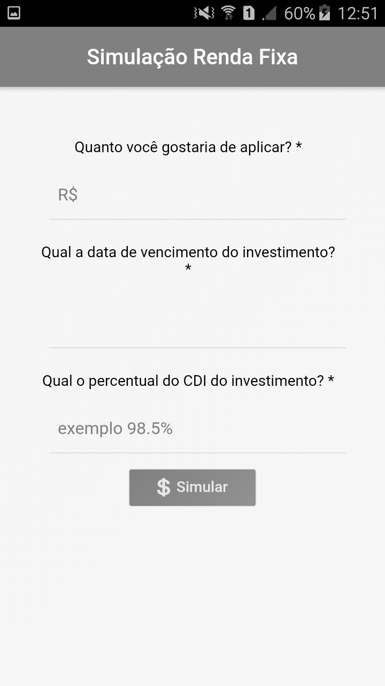
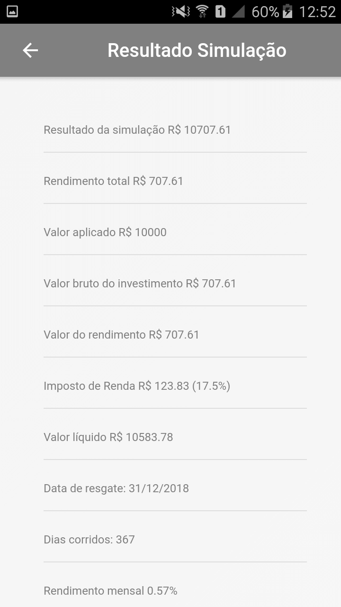

# simulador-rendafixa-app
App para simular a rentabilidade dos investimentos em renda fixa

## Instalação do Ionic e dependências do projeto:
* npm install -g cordova ionic [mais detalhes](https://ionicframework.com/getting-started)
* npm install

## Executar o projeto:
* ionic serve -l (with live reload)

## Deploy para o mobile:
* ionic cordova run android
* ionic cordova run ios






## Utilizando a API

A API que calcula os valores futuros é [este projeto](https://github.com/easynvest/api-simulator-calc). Abaixo segue algumas informações sobre como utilizamos a API no simulador.

 - **URL**: https://api-simulator-calc.easynvest.com.br/calculator/simulate
 - **Method**: POST
 - **URL Params**: 
    ```javascript
    {
        investedAmount: 32323.0                 // Valor a investir em reais
        index: "CDI"                            // Índice, por enquanto só CDI disponível
        rate: 123                               // Percentual do papel
        isTaxFree: false                        // Isento de IR, por enquanto só falso
        maturityDate: "2023-03-03"              // Data do vencimento, no formato ano-mes-dia
    }
    ```
 - **Response**
    ```javascript
    {
        "investmentParameter": {
            "investedAmount": 32323.0,                      // O valor a ser investido
            "yearlyInterestRate": 9.5512,                   // Rentabilidade anual
            "maturityTotalDays": 1981,                      // Dias corridos
            "maturityBusinessDays": 1409,                   // Dias úteis
            "maturityDate": "2023-03-03T00:00:00",          // Data de vencimento
            "rate": 123.0,                                  // Percentual do papel
            "isTaxFree": false                              // Isento de IR
        },
        "grossAmount": 60528.20,                            // Valor bruto do investimento
        "taxesAmount": 4230.78,                             // Valor do IR
        "netAmount": 56297.42,                              // Valor líquido
        "grossAmountProfit": 28205.20,                      // Rentabilidade bruta
        "netAmountProfit": 23974.42,                        // Rentabilidade líquida
        "annualGrossRateProfit": 87.26,                     // Rentabilidade bruta anual
        "monthlyGrossRateProfit": 0.76,                     // Rentabilidade bruta mensal
        "dailyGrossRateProfit": 0.000445330025305748,       // Rentabilidade bruta diária
        "taxesRate": 15.0,                                  // Faixa do IR (%)
        "rateProfit": 9.5512,                               // Rentabilidade no período
        "annualNetRateProfit": 74.17                        // Rentabilidade líquida anual
    }
    ```

- **Simulação**: https://api-simulator-calc.easynvest.com.br/calculator/simulate?investedAmount=1000.0&index=CDI&rate=94.5&isTaxFree=false&maturityDate=2017-12-31

## Referências
* https://github.com/easynvest/simulador-rendafixa
* https://easynvest.github.io/simulador-rendafixa

## Direitos autorais
Este projeto utiliza a API para os cálculos da rentabilidade e logomarca de propriedade da Easynvest - Título Corretora de Valores SA, inscrita sob o CNPJ 62.169.875/0001-79

## Licença
* [Licença](LICENSE)
